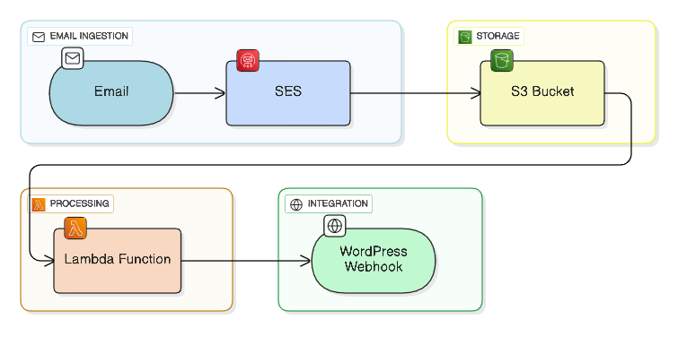

### Amazon Lambda implementation for Fluent Support Email Piping
This repo is an update to the original WPManageNinja/fluent-support-email-parser. The original was unmaintained
and had no real documentation on how to implement it.

## What's changed from the original:
- Usable documentation on how to use the code.
- Proper testing usual actual configuration data.
- Uses node version 22, upgrade 14.
- Uses aws sdk 3. Make it much lighter which results in faster startup time, this makes it cheaper to use.
- Handles multiple domains.
- Implements authentication to WordPress.
- Better error handling.
- IAM Access that follows the principle of least privilege.



## Overview of requirements
1. Have an AWS Console account setup, preferably with an Admin user with adminrights associated with it.
2. Have SES setup with your email domain as verified. Ensure DKIM etc is configured with DNS.
3. WordPress with Fluent Support enabled.
- Optional: I've found Fluent SMTP better for multiple outgoing email addresses than Sure Mail.

## Overview of Steps
1. Create an AWS access key for your admin account.
2. On your location machine, clone this repo.
3. Install NPM, install and configure aws, install serverless.
4. Configure mappers.js and serverless.yml

## Setup Steps

### AWS - SES
- Setup SES with inbound email handling:
  - Create a SES verified Domain but do not setup the "Rule Set", you'll do this later.
  - Verify that your endpoint is in an AWS Region that supports email receiving: https://docs.aws.amazon.com/general/latest/gr/ses.html#ses_inbound_endpoints
  - Verify the domain that you want to use for receiving emails: https://docs.aws.amazon.com/ses/latest/dg/creating-identities.html#just-verify-domain-proc
  - Add a mail exchanger record (MX record) to your domain's DNS configuration: https://docs.aws.amazon.com/ses/latest/dg/receiving-email-mx-record.html
    - You can use any DNS provider, not just AWS.

## Local Machine
- On your local machine, install and configure aws command line tools.
- Install NodeJS, version 22.
- Install serverless command line tools.
- Clone this repository to your local machine.

### WordPress
For each WordPress system / domain, you'll need to perform these steps:

- Install Fluent Support (Pro version not needed)
- Add `define('FLUENTSUPPORT_ENABLE_CUSTOM_PIPE', true);` on your WordPress site's wp-config.php file to enable custom
  email piping for Fluent Support.
- Create an email inbox in Fluent Support as email type and you should get a webhook url for email piping, save
  this URL for the `mappers.js` steps below.
- Using a WordPress admin account, create a new API key. Label it something like: AWS SES Fluent SMTP
- Save each credential to Amazon AWS cloud secure storage with the following command:

 ```bash
aws ssm put-parameter --name "/fluent-support/DOMAIN-pass" --value "XXXX YYYY ZZZZ AAAA BBBB CCCC" --type SecureString
```
An example, if my WordPress site was at https://example.com:
```bash
aws ssm put-parameter --name "/fluent-support/example-com-pass" --value "abcd 1234 efgh 5678 ijkl 9012" --type SecureString
```

Tp update the ssm, you can run this again, or use the AWS Console, and go tinto the `Systems Manager` area, under
`Application Tools`, select `Parameter Store`.

## Local Machine - Continued

- Navigate to your local copy of this repository.
- run `npm install`
- Edit `serverless.yml`:
  - Line Numbers `5 & 8`: Choose a unique S3 bucket name but follow the
    [normalizing Rules](https://serverless.com/framework/docs/providers/aws/guide/resources#aws-cloudformation-resource-reference)
    to allow using the name for the `bucketRef`. To keep it working use a name which  contains only the characters a-z.
    The `bucketRef` is the constant string `S3Bucket` plus the `bucket` name with the first letter uppercase.
    - It's important to make sure the bucket name starts with an uppercase letter after `S3Bucket`.
  - Line number 23+: For each domain you support, you must add a unique set of environment variables for the username
    and password. The keys (e.g., `EXAMPLE_COM_USER`) must be unique per domain. See `mappers.js` file for hints.
- If you change the region, check if SES receiving exists in your region
- Edit `mappers.js`:
  - You'll need to items to both `domainCredentials` and `getChannel`.
    - `domainCredentials`: For every domain, you'll need to create an entry to fetch the API credentials.
    - `getChannel`: For every email, you'll need a new line from the above 'Setup in WordPress.' Don't
      copy/paste the lines and change only the last portion, this will not work. Do copy the entire line from the
      Fluent Support piping setup.

## Deploy

To deploy to dev:

```bash
serverless deploy
```

Or to deploy to production:
```bash
serverless deploy --stage production
```

There's not much difference between the two and both are functional. Dev has additional logging to CloudWatch. This
may incur additional usage fees for both lambda runtime and CloudWatch storage. Recommendation: deploy to dev,
test it out. After a few days, weeks, etc, then 'serverless remove' and then deploy production.

**Don't** go poking around AWS until the deployment is complete. Be patient.

## AWS - SES Continued
Setup SES Email Receiving Rule**

1) Open the Amazon SES console at https://console.aws.amazon.com/ses/
2) In the navigation pane, under Email Receiving, choose Rule Sets.
3) Choose **Create a Receipt Rule**.
4) On the Recipients page, choose **Next Step**. (Without a adding any recipients, Amazon SES applies this rule to all recipients)
5) For **Add action**, choose **S3**.
6) For **S3 bucket**,choose **Enter a bucket name** and select the bucket with the name you defined in `serverless.yml`
7) Choose **Next Step**
8) On the **Rule Details** page, for **Rule name**, type **my-rule**. Select the check box next to **Enabled**, and then choose **Next Step**.
9) On the **Review** page, choose **Create Rule**.

## Remove
To remove this entire package from AWS, including the bucket, Lambda function, and CloudWatch, simply run
`serverless remove`.

**Important:** Before running the `serverless remove` command, you must empty the s3 bucket first.

```bash
serverless remove
```

If you forget to empty the bucket first, just do it now and rerun the command.

## Testing
This tests your configuration, as well as the hander.js and mappers.js files locally.

This project includes a robust, automated integration test suite that you can run locally. It uses
[Mocha](https://mochajs.org/) and [Sinon.js](https://sinonjs.org/) to simulate a real S3 event and verify that
the handler logic correctly parses emails and calls the appropriate webhook with the correct credentials.

### Setup

- **Create a `.env` file:** Copy the example environment file to a new file named `.env`.
- Update the .env and update/add the testing information. The .env file isn't needed for production, unless
  an additional HTTP header is needed.

### What it tests

The tests will check for:
- Check that your .env file exists and is correctly configured.
- Uses the .env file to check your mappers.js file.
- Generate a test email using the TEST_EMAIL_ADDRESS from your .env file.
- Trigger the handler.postprocess function with a mock S3 event.
- Assert that the correct webhook URL and authentication headers were used.

### Run Tests

```besth
npm test
```
